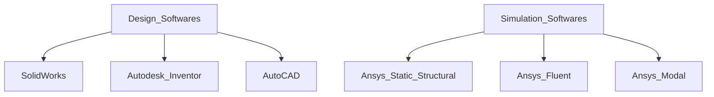
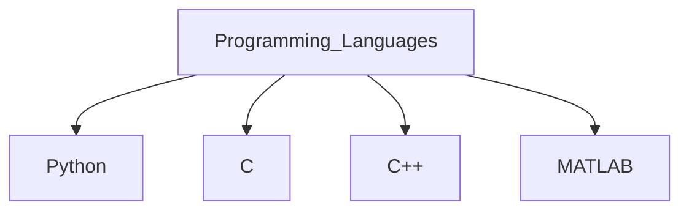

# Hi, I'm Harshvardhan :wave:
I'm an undergraduate final year student pursuing B.Tech in Mechanical Engineering and Minor Specialization in Robotics and Automation from Nirma University. I'm greatly interested in:

:robot: Robotics and Automation

:desktop_computer: Machine Learning and Artificial Intelligence

:helicopter: Aeronautics

I enjoy learning new things regardless of where they come from :blush:.

❓**Where you can find me** ➡️ [HARSHVARDHAN R SAXENA](https://www.linkedin.com/in/harshvardhan-saxena?lipi=urn%3Ali%3Apage%3Ad_flagship3_profile_view_base_contact_details%3BZdZs7RfpS5ust5SFaQH9dg%3D%3D)

## What I Know ❔

